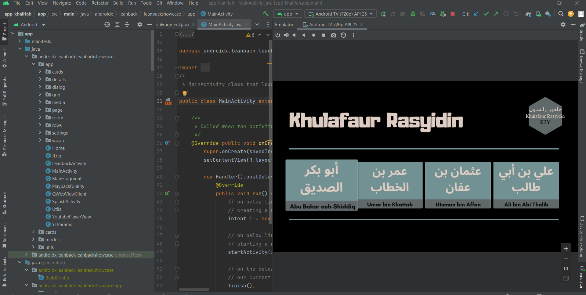
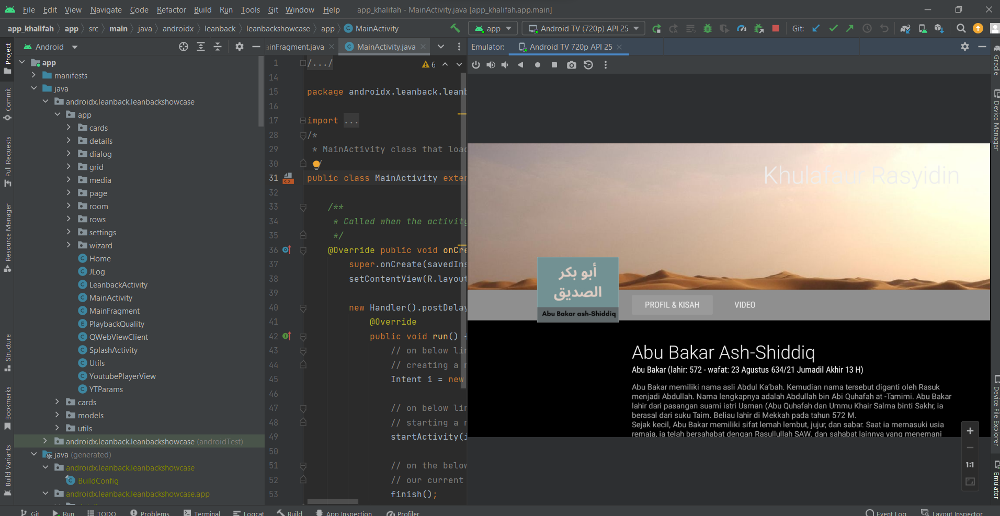
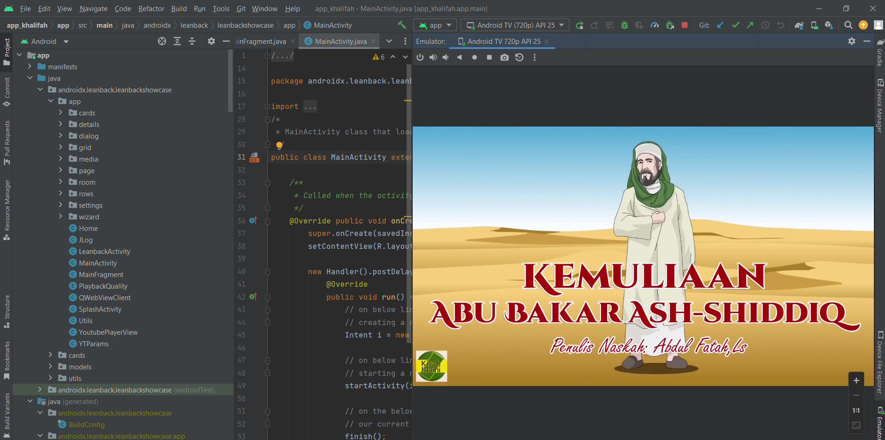
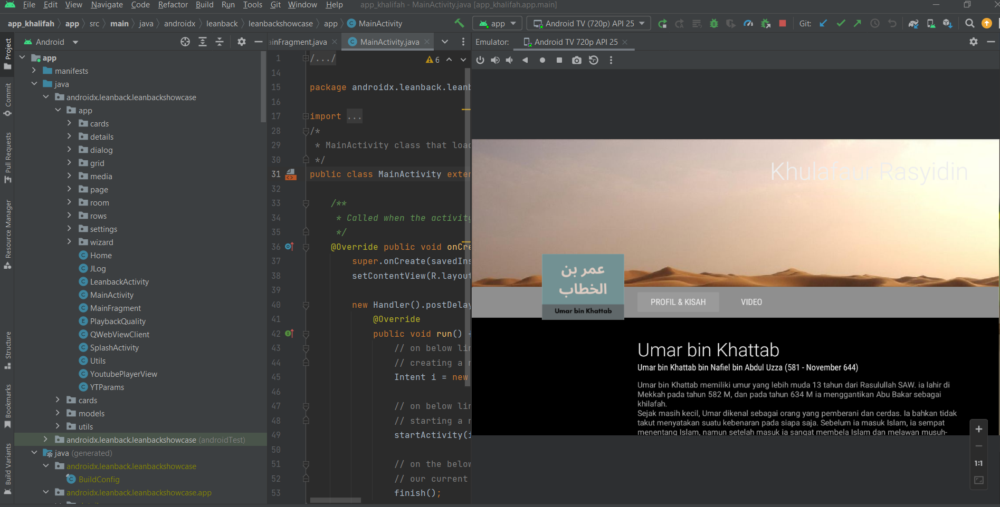
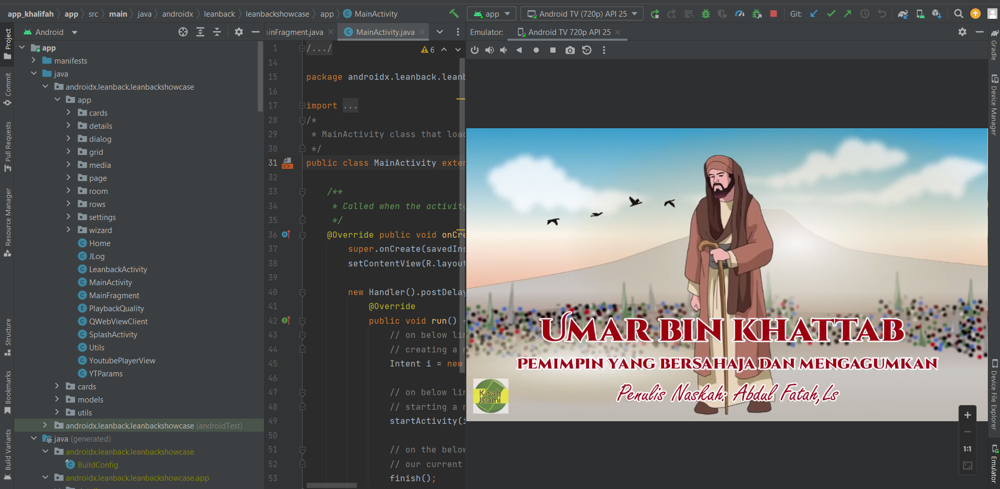
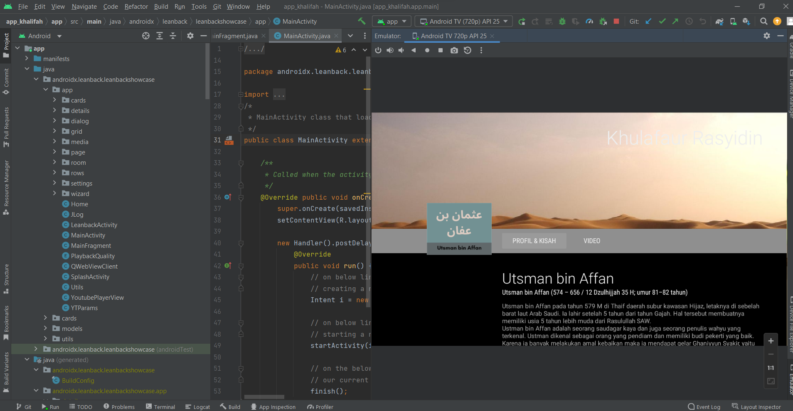
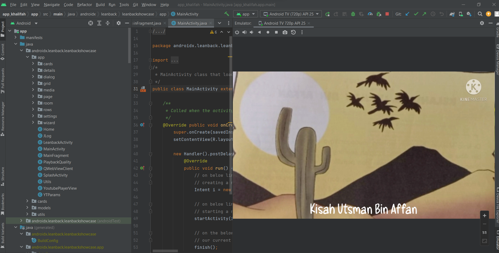
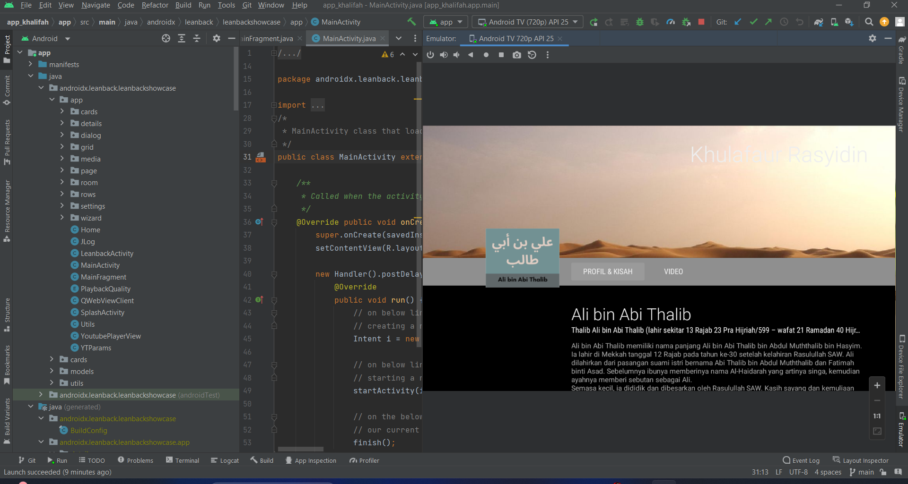
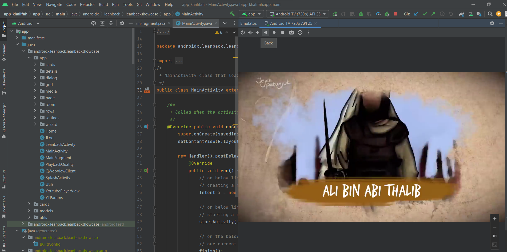

# kelompok_mobile

```sh
DISUSUN OLEH KELOMPOK 2 KELAS TI.21.C.5 :
1.	A. REZA BAEHAQA JAMRONI 	(312110494)
2.	YUGO RILO FAMBUDI 		(312110228)
3.	ROBBY FADILLAH 			(312110461)
4.	RIZKY ROMA DHONY 		(312110088)
```

### Latar Belakang project

Dalam era teknologi yang canggih, banyak anak-anak dan orang dewasa terjebak dalam penggunaan ponsel sepanjang hari, melupakan pentingnya pemahaman tentang sejarah dan kisah-kisah Islami. Untuk mengatasi hal ini, kami hadirkan aplikasi "E-Story Islamic" yang menawarkan pengalaman menarik dalam mempelajari profil dan kisah inspiratif Khulafaur Rasyidin serta konten video Islami. <p>

Aplikasi ini memungkinkan pengguna mengeksplorasi kepemimpinan para Khulafaur Rasyidin, menikmati kisah Islami yang inspiratif, dan menyaksikan video berkualitas tinggi tentang tokoh-tokoh Islami terkemuka. Dengan aplikasi ini, kami berharap dapat menginspirasi pengguna untuk meningkatkan pemahaman mereka tentang sejarah dan nilai-nilai Islami, serta memperkuat kecintaan terhadap agama Islam di era digital ini.<p>

### Hasil Project

Berikut adalah hasil capture project kelompok 2 yang run menggunakan emulator pada android studio.<p>

### Tampilan Utama

<p>

### Slide 1

<p>
<p>

### Slide 2

<p>
<p>

### Slide 3

<p>
<p>

### Slide 3

<p>
<p>
